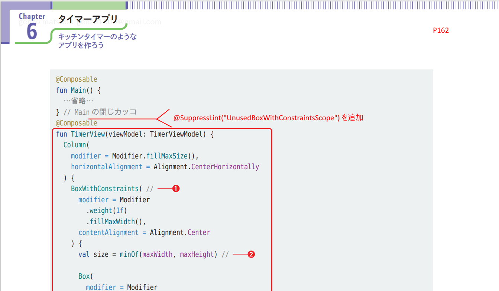
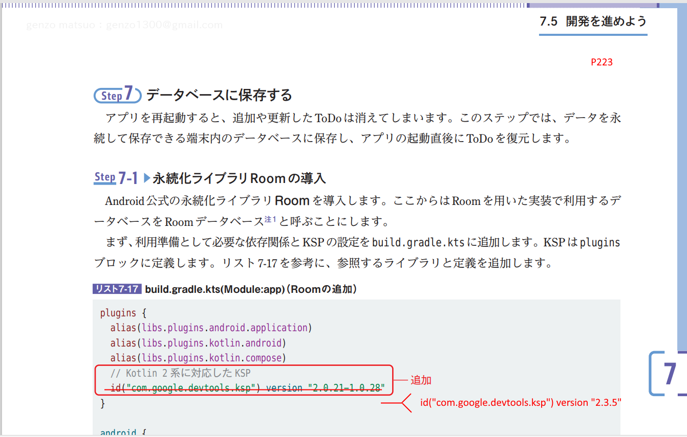

# 基本から楽しく開発するAndroidアプリ Android Studio Panda 2 | 2025.3.2 対応

[戻る](../README.md)

Panda2では、AGPのバージョンアップおよび、Kotlinのバージョンアップが大きな変更点です。

- AGPのバージョンアップ(9.0.1 → 9.1.0)
- kotlinのバージョンアップ(2.0.21 → 2.2.10)

### ■Chapter06 注釈の追加

P162
@Composable
の前に、
```
@SuppressLint("UnusedBoxWithConstraintsScope")
```
を追加する。

その他(マイナーな変更なのでそのままでもOK)
- androidx.datastore:datastore-preferences のバージョンアップ(1.2.0 → 1.2.1)

### ■Chapter07 KSPの変更

P223 KPSのバージョンを変更する
```
//id("com.google.devtools.ksp") version "2.0.21-1.0.28"
id("com.google.devtools.ksp") version "2.3.5" // Kotlin 2系 AndroidStudio Pandaに対応したKSP
```

### ■Chapter08 CameraX,navigation-composeのバージョンアップ
ライブラリのマイナーなバージョンアップ。そのままでもOK
- androidx.camera:camera-camera2(1.5.2 → 1.5.3)
- androidx.camera:camera-core(1.5.2 → 1.5.3)
- androidx.camera:camera-lifecycle(1.5.2 → 1.5.3)
- androidx.camera:camera-view(1.5.2 → 1.5.3)
- androidx.navigation:navigation-compose(2.9.7 → 2.9.7)

### ■Chapter09 coil,navigation-composeのバージョンアップ
ライブラリのマイナーなバージョンアップ。そのままでもOK
- io.coil-kt.coil3:coil-compose(3.2.0 → 3.4.0)
- io.coil-kt.coil3:coil-network-okhttp(3.2.0 → 3.4.0)
- androidx.navigation:navigation-compose(2.9.7 → 2.9.7)


