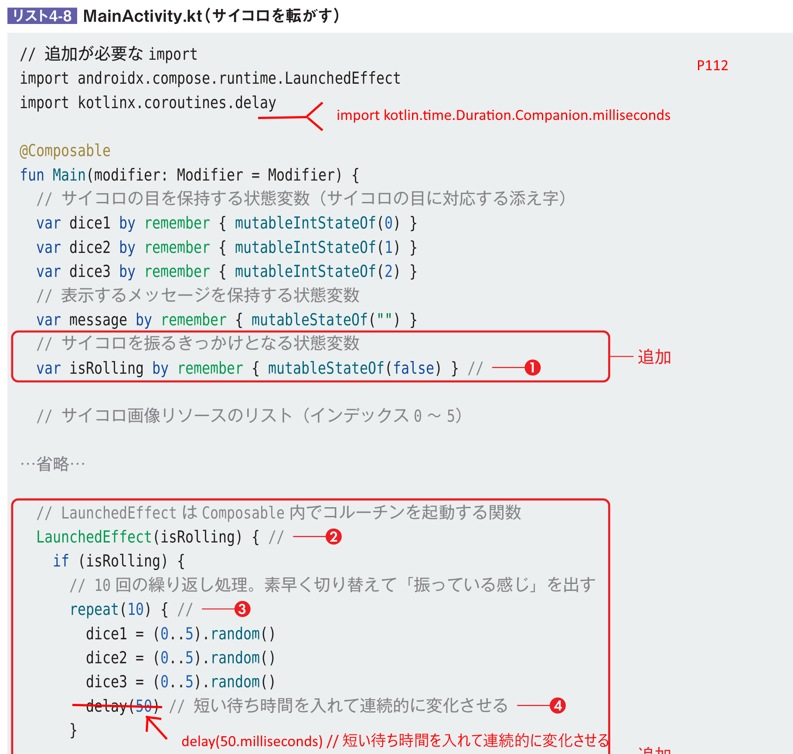
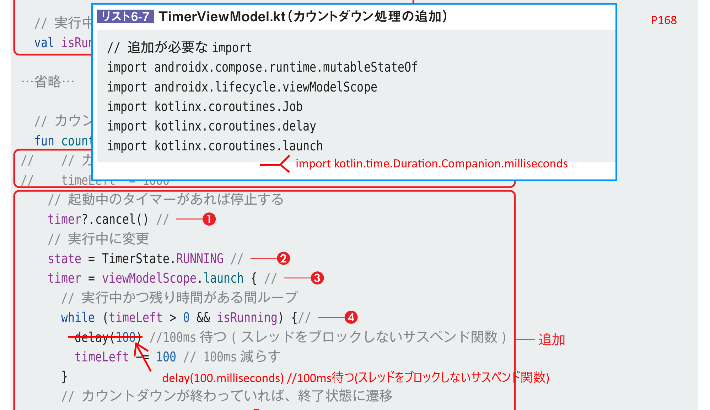

# 基本から楽しく開発するAndroidアプリ Android Studio Quail 1 | 2026.1.1 Patch 1 対応

[戻る](../README.md)

Quail1では、AGPのバージョンアップが大きな変更点です。

- AGPのバージョンアップ(9.1.1 → 9.2.1)

その他のライブラリは、panda3と比べて微妙にバージョンが下がっているのがちょっと気になる。。。

### ■Chapter03 単位の指定(delay(50)→delay(50.milliseconds))

P112
にインポート文を追加
``` kotlin
import kotlin.time.Duration.Companion.milliseconds
```

50に単位をつける
``` kotlin
  //delay(50) // 短い待ち時間を入れて連続的に変化させる
  delay(50.milliseconds) // 短い待ち時間を入れて連続的に変化させる
```

### ■Chapter06 注釈の追加

P162
@Composable
の前に、
``` kotlin
@SuppressLint("UnusedBoxWithConstraintsScope")
```
を追加する。


P168
にインポート文を追加
``` kotlin
import kotlin.time.Duration.Companion.milliseconds
```

100に単位をつける
``` kotlin
  //delay(100) //100ms待つ(スレッドをブロックしないサスペンド関数)
  delay(100.milliseconds) //100ms待つ(スレッドをブロックしないサスペンド関数)
```


その他(マイナーな変更なのでそのままでもOK)
- androidx.datastore:datastore-preferences のバージョンアップ(1.2.0 → 1.2.1)

### ■Chapter07 KSPの変更

リスト7-2を実装する前に、build.gradle.kts(Module:app)にライブラリ(**androidx.compose.material:material-icons-extended**)を追加します。
追加しないと、ビルドが通過しません。
``` kotlin
dependencies {
  // 以下を追加
  implementation("androidx.compose.material:material-icons-extended") // material-icons-extended

  // 以下は変更しない 
  implementation(libs.androidx.core.ktx) 
  implementation(libs.androidx.lifecycle.runtime.ktx)
}
```
build.gradle.kts(Module:app)の変更は、P205などを参考にしてください。


P223 KPSのバージョンを変更する
``` kotlin
//id("com.google.devtools.ksp") version "2.0.21-1.0.28"
id("com.google.devtools.ksp") version "2.3.6" // Kotlin 2系 AndroidStudio Pandaに対応したKSP
```

### ■Chapter08 CameraX,navigation-composeのバージョンアップ
ライブラリのマイナーなバージョンアップ。そのままでもOK
- androidx.camera:camera-camera2(1.5.2 → 1.6.1)
- androidx.camera:camera-core(1.5.2 → 1.6.1)
- androidx.camera:camera-lifecycle(1.5.2 → 1.6.1)
- androidx.camera:camera-view(1.5.2 → 1.6.1)
- androidx.navigation:navigation-compose(2.9.7 → 2.9.8)

### ■Chapter09 coil,navigation-compose,gsonのバージョンアップ
ライブラリのマイナーなバージョンアップ。そのままでもOK
- io.coil-kt.coil3:coil-compose(3.2.0 → 3.4.0)
- io.coil-kt.coil3:coil-network-okhttp(3.2.0 → 3.4.0)
- com.google.code.gson:gson(2.13.2 → 2.14.0)
- androidx.navigation:navigation-compose(2.9.7 → 2.9.8)

※：coilの3.5.0系に対応する場合、合わせてビルド用のSDKを37系にあげる必要がある。


